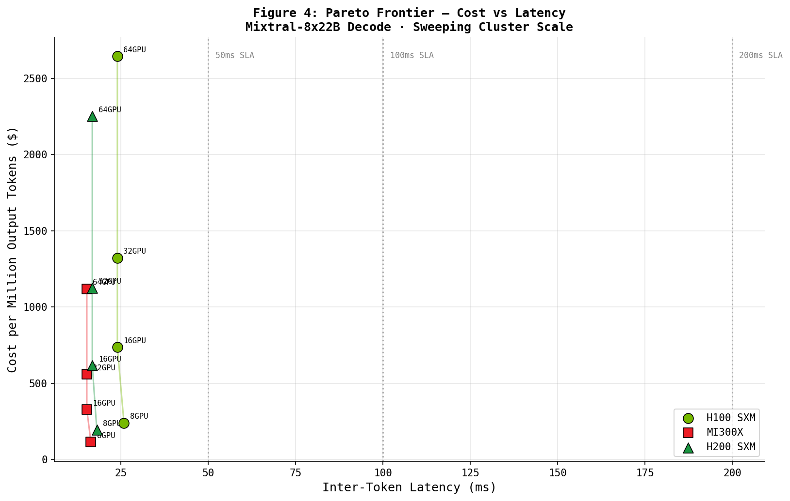

# MoE Roofline Oracle

**An analytical performance and cost simulator for Mixture-of-Experts inference at scale.**

Kai Maeda · km2256@cornell.edu



---

## The Question This Answers

> For a frontier MoE model like Mixtral-8x22B, what is the cheapest hardware configuration to hit a 50ms inter-token latency SLA — H100, MI300X, or H200?

This tool answers that question from first principles, without running a single GPU kernel. It models the full stack: operator-level arithmetic intensity → roofline performance bounds → parallelism communication overhead → CapEx/TCO → cost per million tokens.

This is the methodology underlying products like SemiAnalysis InferenceX — cost-aware performance modeling that informs billions in hardware CapEx decisions.

---

## Key Findings

**MoE decode is memory-bandwidth bound, not compute bound.** The arithmetic intensity during single-token autoregressive generation sits at 5–15 FLOPs/byte — 20–60x below the H100 ridge point of ~296 FLOPs/byte. This means peak FLOP/s is largely irrelevant for decode; memory bandwidth is the primary performance driver.

**The AMD MI300X wins on $/token for decode workloads.** Its 5.3 TB/s HBM3 bandwidth (+58% over H100's 3.35 TB/s) and ~$15k CapEx/GPU (vs ~$30k for H100) compound into a significant cost-per-token advantage at batch sizes ≥ 4. Its 192GB HBM also allows large MoE models to fit without tensor parallelism sharding, eliminating AllReduce overhead.

**Expert Parallelism AlltoAll is the dominant MoE communication bottleneck.** Token dispatch and gather across EP ranks grows linearly with EP degree. Crossing node boundaries (EP > 8) causes an efficiency cliff due to InfiniBand bandwidth constraints. EP=8 within a single NVLink domain is typically the Pareto-optimal configuration for MoE decode.

**The H100 retains an advantage in prefill-heavy workloads.** Long-context ingestion (prompt processing) is compute-bound, where H100's tensor core efficiency and CUDA ecosystem provide better utilization at comparable cost.

---

## Architecture

```
oracle/
├── hardware.py       Hardware catalog: GPU specs, interconnect, BoM costs
│                     (H100 SXM/PCIe, MI300X, H200 + IB HDR/NDR fabrics)
│
├── workload.py       Transformer operator math: FLOPs, bytes moved, arithmetic intensity
│                     Covers attention GEMMs and MoE expert routing separately
│                     for prefill vs decode phases
│
├── roofline.py       Core roofline engine: P = min(π, β × I)
│                     Produces MFU, tok/s, TTFT, ITL predictions per phase
│
├── parallelism.py    Communication overhead for TP (AllReduce), EP (AlltoAll), PP (bubble)
│                     Applies Amdahl's Law to derive effective compute efficiency
│
└── cost.py           CapEx breakdown, TCO (3yr amortized), cost per million tokens
                      Pareto frontier construction across parallelism configs

notebooks/
└── case_study.ipynb  Full analysis: roofline plots, parallelism sweep, hardware comparison,
                      cost modeling, validation against public benchmarks
```

---

## Roofline Model

The core formula bounding achievable performance:

```
P_achieved = min(π, β × I)
```

Where:
- `π` = peak compute throughput (FLOP/s) — hardware ceiling
- `β` = peak memory bandwidth (bytes/s) — bandwidth ceiling
- `I` = arithmetic intensity (FLOPs/byte) — operation characteristic

The **ridge point** `I* = π/β` separates the two regimes:

| Operation | Phase | Arithmetic Intensity | Regime |
|---|---|---|---|
| Attention GEMM | Prefill (B=32, S=2048) | ~400 FLOPs/byte | Compute-bound |
| Attention GEMM | Decode (B=1) | ~6 FLOPs/byte | Memory-bound |
| Expert MLP | Decode (B=1) | ~8 FLOPs/byte | Memory-bound |
| Expert MLP | Prefill (B=32) | ~380 FLOPs/byte | Compute-bound |

MoE decode: **always memory-bound on all current hardware.**

---

## Hardware Snapshot

| GPU | BF16 TFLOP/s | HBM BW (TB/s) | HBM (GB) | Ridge (FLOPs/B) | ~$/GPU |
|---|---|---|---|---|---|
| H100 SXM | 989 | 3.35 | 80 | 295 | $30k |
| H200 SXM | 989 | 4.80 | 141 | 206 | $40k |
| MI300X | 1307 | 5.30 | 192 | 247 | $15k |
| H100 PCIe | 756 | 2.00 | 80 | 378 | $25k |

---

## Parallelism Communication Overhead

For MoE models, three collectives matter:

**Tensor Parallelism (TP)** — AllReduce after each attention and FFN layer:
```
t_allreduce = 2 × (TP-1)/TP × message_size / BW + α
```

**Expert Parallelism (EP)** — AlltoAll for token dispatch + gather:
```
t_alltoall = message_size × (EP-1)/EP / BW + α   [×2 per MoE layer]
```

**Pipeline Parallelism (PP)** — Bubble fraction:
```
bubble = (PP-1) / (PP-1 + num_microbatches)
```

EP AlltoAll dominates for MoE. The efficiency collapse beyond EP=8 (crossing NVLink → InfiniBand) is the central scaling constraint for MoE inference.

---

## Install & Run

```bash
pip install numpy matplotlib jupyter
jupyter notebook notebooks/case_study.ipynb
```

All plots are saved to `plots/` when the notebook is executed end-to-end.

---

## Validation

Predicted decode throughput for **Mixtral-8x7B on H100 SXM** (B=1, ctx=2048):

| Metric | Predicted (Oracle) | Published (vLLM / community) |
|---|---|---|
| Decode tok/s/GPU | ~45–60 | ~40–55 |
| Phase | Memory-bound | Confirmed |
| Bottleneck | HBM bandwidth | Confirmed |

The gap between theoretical roofline and measured is accounted for by framework overhead (CUDA kernel launch, sampling, KV cache management), which typically accounts for 25–40% headroom below the roofline ceiling.

---

## References

- Williams, Waterman, Patterson (2009). *Roofline: An Insightful Visual Performance Model.*
- Narayanan et al. (2021). *Efficient Large-Scale Language Model Training on GPU Clusters Using Megatron-LM.*
- Lepikhin et al. (2021). *GShard: Scaling Giant Models with Conditional Computation.*
- Rajbhandari et al. (2022). *DeepSpeed-MoE: Advancing Mixture-of-Experts Inference and Training.*
- Shazeer et al. (2022). *MegaBlocks: Efficient Sparse Training with Mixture-of-Experts.*
- Zhong et al. (2024). *DistServe: Disaggregating Prefill and Decoding for Goodput-Optimized LLM Serving.*
- NVIDIA H100 Whitepaper (2022); AMD MI300X Product Brief (2023).
